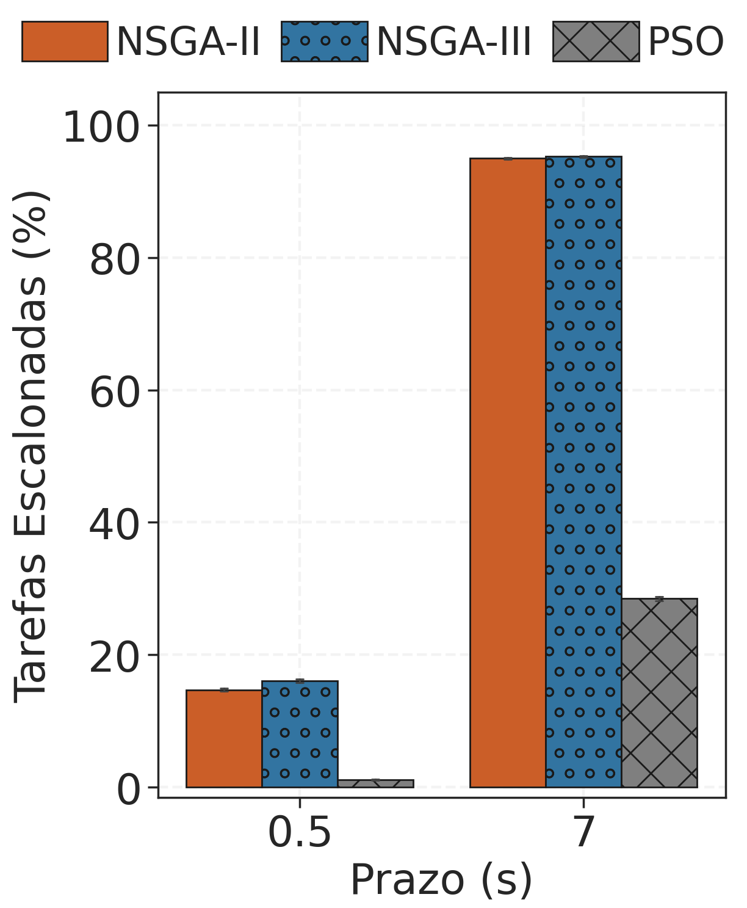
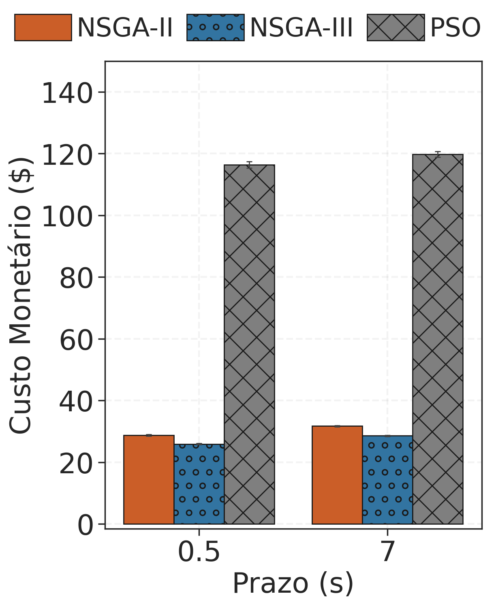
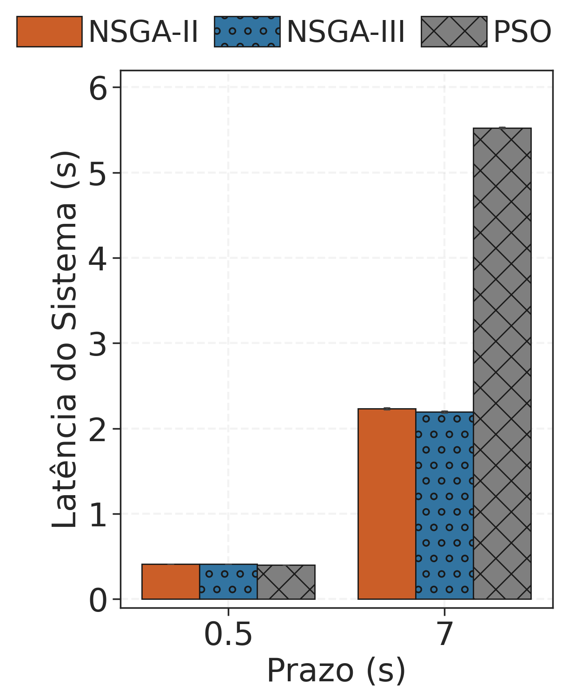
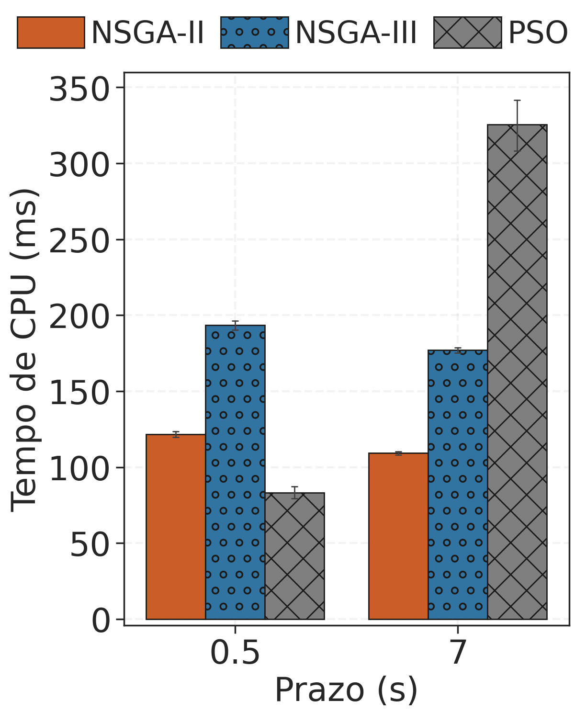
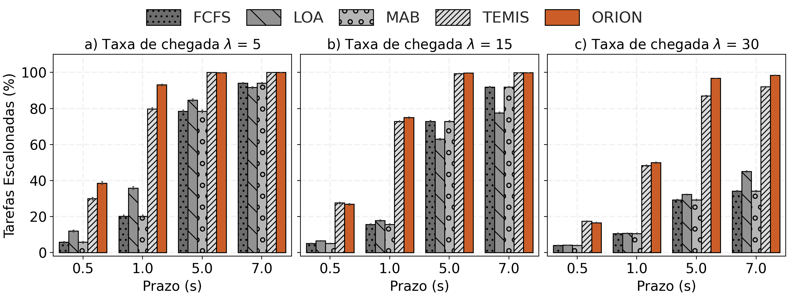
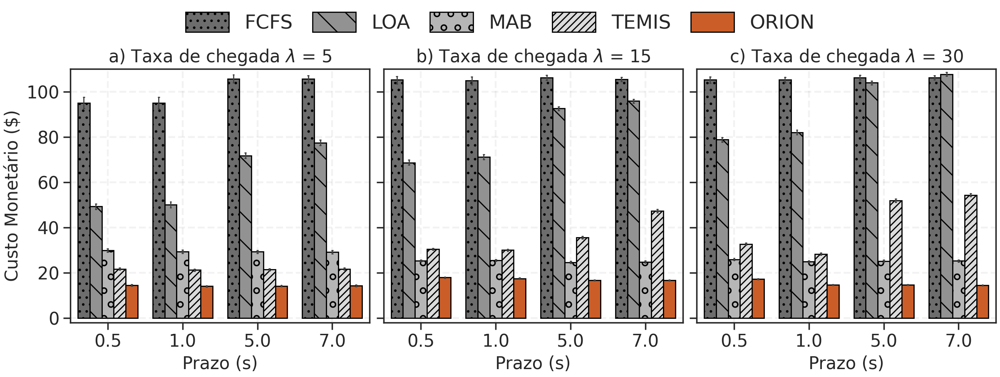
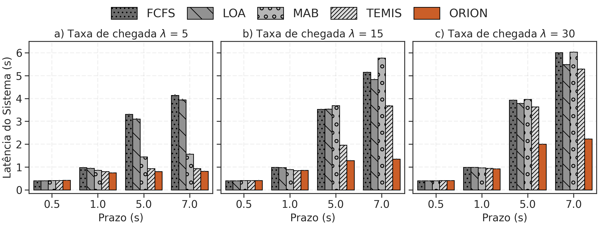
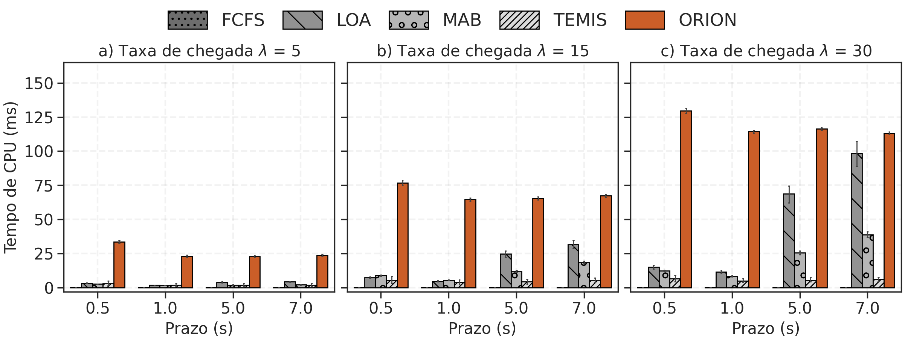

<div align="center">
<pre>
 ██████╗ ██████╗ ██╗ ██████╗ ███╗   ██╗
██╔═══██╗██╔══██╗██║██╔═══██╗████╗  ██║
██║   ██║██████╔╝██║██║   ██║██╔██╗ ██║
██║   ██║██╔══██╗██║██║   ██║██║╚██╗██║
╚██████╔╝██║  ██║██║╚██████╔╝██║ ╚████║
 ╚═════╝ ╚═╝  ╚═╝╚═╝ ╚═════╝ ╚═╝  ╚═══╝
Computação de Borda Veicular
</pre>
</div>

# ORION: Escalonamento de Tarefas baseado em Otimização Multiobjetivo para Nuvens Veiculares

A Computação de Borda Veicular (VEC) surge como um paradigma promissor para atender à crescente demanda por processamento de baixa latência em aplicações veiculares, impulsionada pelo aumento contínuo de veículos conectados e pela geração massiva de dados. No entanto, a natureza dinâmica e as restrições de recursos desse ambiente impõem desafios significativos para o escalonamento eficiente de tarefas computacionais. Neste trabalho, propõe-se o ORION, um escalonador baseado em otimização multiobjetivo que utiliza o algoritmo NSGA-II para equilibrar objetivos conflitantes: maximizar o número de tarefas concluídas dentro dos prazos, minimizar o custo monetário e reduzir a latência do sistema. Os resultados demonstram que o ORION supera outras soluções de escalonamento de tarefas em VEC, especialmente em cenários de alta demanda por recursos, mantendo altas taxas de escalonamento, reduzindo custos e alcançando níveis aceitáveis de latência.


Artigo aprovado na Trilha Principal do [SBRC 2026](https://sol.sbc.org.br/index.php/sbrc/article/view/42351).

# Dependências

A seguir, são listadas as dependências necessárias para a execução do ambiente VEC considerado pelo ORION.

## Hardware

- Sistema Operacional: Linux (testado no Ubuntu 22.04.5 LTS e Ubuntu 24.04.4 LTS)
- CPU: Mínimo 2 cores (Recomendado: 4+ cores)
- RAM: Mínino 4GB (Recomendado: 8GB+)
- Armazenamento: Mínimo 5GB livre (Recomendado: 10GB+ dependendo do volume de dados)

## Software

- git: `sudo apt install git`
- GNU Parallel: `sudo apt install parallel`
- Python3 (testado nas versões 3.10.12 e 3.12.3)
- Python3-pip e Python3-venv: `sudo apt install python3-pip python3-venv`
- _Simulation of Urban MObility (SUMO)_ versão 1.18.0:
    - Instalação automática (recomendada): `sudo apt install sumo`. Após instalar, adicione a variável de ambiente `SUMO_HOME` no arquivo `.bashrc` com o seguinte comando:
        ```bash
        export SUMO_HOME="/usr/share/sumo"
        ```
    - Instalação manual: [Tutorial de instalação](https://joahannes.github.io/blog/2024/omnet-veins-sumo/)
- As demais dependências constam no arquivo `requirements.txt` que devem ser instaladas no passo 5 da Instalação

# Instalação

1. Clonar repositório
	```bash
	git clone https://github.com/joahannes/ORION.git
	```
2. Acessar diretório criado
	```bash
	cd ORION/
	```
3. Criar ambiente virtual
    ```bash
    python3 -m venv venv/
    ```
4. Acessar ambiente virtual
    ```bash
    source venv/bin/activate
    ```
5. Instale os pacotes necessários
    ```bash
    pip install -r requirements.txt
    ```
6. Acessar diretório `system/`
    ```bash
    cd system/
    ```
7. No diretório `system/`, alterar a variável `PATH` no arquivo de configuração `src/utils/constants.py` com o comando abaixo:
	```bash
    sed -i "s|^PATH *=.*|PATH = '$PWD/'|" src/utils/constants.py
	```
8. Instalação do ambiente VEC finalizada!

# Informações básicas

## Execução

Quando for executar os experimentos, utilize os scripts (`teste.sh` e `run.sh`) para configurar e automatizar a inserção dos parâmetros de simulação no arquivo `simulation.py`. O arquivo `simulation.py` é responsável por iniciar o experimento e contém os seguintes parâmetros de configuração:

#### Configuração da Simulação
- `scenario` (default: `"cologne"`): Cenário de mobilidade utilizado na simulação.
- `interval` (default: `5`): Intervalo de tempo (em segundos) entre as atualizações do processo de formação de nuvens veiculares.
- `begin` (default: `100`): Tempo inicial da simulação.
- `start_process` (default: `100`): Tempo a partir do qual o processamento das tarefas começa.
- `simulation_time` (default: `500`): Tempo total de execução da simulação.
- `step_lenght` (default: `0.1`): Granularidade temporal da simulação (tamanho do passo).
- `resources` (default: `1`): Quantidade de recursos computacionais disponíveis por veículo.

#### Configuração de Tarefas
- `task_rate` (default: `"5 15 30"`): Taxa de chegada de tarefas.
- `task_size` (default: `10`): Tamanho das tarefas.
- `cpu_cycle` (default: `30`): Quantidade de ciclos de CPU necessários para processar cada tarefa.
- `deadlines` (default: `"0.5 1 5 7"`): Prazos (deadlines) das tarefas.

#### Configuração de Execução
- `algorithms` (default: `"FCFS LOA MAB TEMIS NSGA3 PSO ORION"`): Algoritmos de escalonamento considerados.
- `total_seeds` (default: `"1 2 3 4 5"`): Seeds utilizadas para variação estocástica das tarefas.
- `seed_sumo` (default: `2`): Seed de mobilidade utilizada no simulador SUMO.

Além disso, o ambiente VEC (`system/`) conta com os seguintes diretórios:

```text
system/
├── input                   # Armazena dados de entrada para simulações
│   ├── tasks               # Definições e configurações de tarefas
|   |   └── deadline        # Arquivos com cargas de tarefas 
│   └── temp                # Arquivos com informações temporais das BSs
├── log                     # Registros e logs do sistema
├── output                  # Artefatos gerados pelas simulações
├── results                 # Resultados processados e métricas finais
├── scenario                # Cenários de simulação SUMO
│   └── cologne             # Cenário específico da cidade de Colônia
├── src                     # Código-fonte Python da aplicação
│   ├── scheduler           # Implementação dos algoritmos de escalonamento
│   │   └── include         # Headers e interfaces de escalonador
│   └── utils               # Utilitários, constantes e funções auxiliares
└── summary                 # Arquivo de saída do SUMO com informações de mobilidade
```

**Observação**: na primeira execução, os diretórios `log/`, `output/`, `results/`, `summary/` são criados automaticamente.

A pasta `system/input/tasks/` possui dois scripts importantes:
1. `generate_number_tasks.py`: para a geração de arquivos de configuração com a taxa de chegada de tarefas seguindo a distribuição de Poisson.
2. `deadline/genTasks.py`: para a geração de diferentes cargas de trabalho (tarefas) com base nas configurações de ciclos de CPU, deadline, etc.

Por padrão, os arquivos de carga utilizados no artigo já se encontram nas pastas correspondentes em `input/`.

## Organização

Os módulos `.py` que compõem este projeto (presentes na pasta `system/src/`) são mostrados na imagem abaixo.


O ambiente VEC é composto por diferentes módulos, que são descritos a seguir.

- **main**: Ponto de entrada da aplicação que coordena a inicialização dos _managers_, carrega configuração e orquestra o fluxo principal de trabalho: recebe cenários/inputs, inicia simulações (via **sumo_manager**), solicita decisões de escalonamento ao **scheduling_manager**, cria/gerencia tarefas com **task_manager**, aciona **cloud_manager** quando necessário e registra eventos via **log_manager**; trata erros de inicialização e encerra componentes de forma ordenada.

- **cloud_manager**: Responsável por toda a interação com a infraestrutura de nuvem. Provisionamento e término de instâncias, transferência de artefatos e verificação de estados de recursos; expõe operações de alto nível usadas pelo _scheduler_ e pelo gerenciador de tarefas, além de devolver IDs/endereços dos recursos criados. Esse módulo pode consumir, dependendo do algoritmo de escalonamento, informações sobre o número de veículos associados à infraestrutura, contidas na pasta `system/input/temp/`.

- **log_manager**: Centraliza a configuração e o roteamento de logs do sistema, definindo formatação e _handlers_ (console e arquivos em log); também normaliza mensagens estruturadas para facilitar análise e serve de ponto único para instrumentação de eventos e erros.

- **scheduling_manager**: Ajuda na tomada de decisões de escalonamento de tarefas com base em requisitos das tarefas e no estado dos recursos, implementando regras/heurísticas (por exemplo prioridade, custo vs. tempo, limites de recursos) e fornecendo planos de execução para o **task_manager** e **cloud_manager**; também reavalia decisões em caso de variação de disponibilidade ou desempenho. Esse módulo implementa o escalonador propriamente dito. Os escalonadores implementados (FCFS, LOA, MAB, PSO, TEMIS, NSGA3, PSO e ORION) estão no diretório `system/src/scheduler/`.

- **sumo_manager**: Encapsula a interface com o simulador SUMO. Prepara cenários e arquivos de entrada, inicia/para simulações (tipicamente via Traci ou execução de binários), realiza _stepping_/execução e coleta métricas/resultados de simulação, tratando problemas como portas ocupadas, falhas na simulação e geração de artefatos de saída.

- **system_monitor**: Monitora o processo de escalonamento e métricas do ambiente (CPU, memória, I/O e métricas de aplicação) em intervalos regulares, publica essas amostras para outros módulos (p.ex. **scheduling_manager**) e registra alertas quando limites são excedidos; cuida de leituras agregadas/suavizadas e de persistência temporal de métricas para análise.

- **task_manager.py**: Gerencia o ciclo de vida das tarefas do sistema. Criação, enfileiramento, transição de estados (pendente, em execução, concluída, falhada) e persistência/recuperação de estado. Esse módulo é alimentado com os arquivos gerados na pasta `system/input/tasks/`.

Dessa forma, este repositório reúne o ambiente VEC completo, incluindo o escalonador de tarefas ORION, bem como os demais escalonadores utilizados na avaliação comparativa.

# Teste mínimo

**Observação**: Permaneça no ambiente virtual `venv/` e no diretório `system/` para executar as simulações.

Para o teste mínimo, execute o script `teste.sh`. As características desse teste mínimo são mostradas na tabela abaixo.

<table border="1">
<tr><th>Parâmetro</th><th>Valor</th></tr>
<tr><td>Tempo de simulação</td><td>30 segundos</td></tr>
<tr><td>Algoritmos executados</td><td>FCFS e ORION</td></tr>
<tr><td>Taxa de chegada de tarefas no sistema</td><td>5 e 15 tarefas/segundo</td></tr>
<tr><td>Sementes de aleatoriedade</td><td>1 e 2</td></tr>
<tr><td>Prazos de atendimento das tarefas</td><td>0.5 e 7 segundos</td></tr>
</table>

A combinação dos parâmetros acima resultará em 16 execuções independentes.

Para acelerar os experimentos, utilizamos o [GNU Parallel](https://www.gnu.org/software/parallel/), que distribui automaticamente as execuções entre os núcleos de processamento. Assim, execute o script informando o número de núcleos desejado:

```bash
bash teste.sh n_cores
```
**Observação**: use `n_cores > 1` para habilitar execução em paralelo. Quanto mais núcleos utilizar, mais rápida será a execução completa dos experimentos.

Exemplo: com 4 núcleos (```bash teste.sh 4```), a execução do teste mínimo leva cerca de 1m30s.

Os arquivos de resultados gerados são direcionados para os diretórios `output/` e `results/`.

## Resultados do teste mínimo

Para gerar os gráficos do teste mínimo, vá até o diretório `plots/` e use o notebook `plot_teste.ipynb`.  
As figuras serão salvas automaticamente em `plots/teste/` (diretório criado pelo próprio notebook).

Para executá-lo, basta rodar o comando:

```bash
python3 -m notebook plot_teste.ipynb
```

Quatro métricas são consideradas:
1. Tarefas escalonadas (%)
2. Custo monetário ($)
3. Latência do sistema (s)
4. Tempo de uso de CPU (ms)

Neste teste mínimo, comparamos apenas o FCFS (escalonador mais simples) com o ORION, a fim de demonstrar o desempenho superior do ORION em relação ao FCFS. Trata-se apenas de um indicativo de que o ambiente está funcional para a execução dos experimentos completos.

# Experimentos

A execução do script `run.sh` deve ser capaz de reproduzir os resultados apresentados no artigo. Lembre-se de estar no diretório `system/` ao executar o script ```bash run.sh n_cores```.

O tempo estimado para a execução completa dos experimentos é de **aproximadamente 2 horas**, considerando o uso de **15 núcleos de processamento**. Estimativa utilizando máquina com processador Intel Core i7-12700H 20 núcleos (Cache de 24 M, até 4,70 GHz).

Nessa execução completa, serão adotados os parâmetros apresentados na tabela abaixo. A combinação desses parâmetros resulta em **420** execuções independentes.

<table border="1">
<tr><th>Parâmetro</th><th>Valor</th></tr>
<tr><td>Tempo de simulação</td><td>600 segundos (100 segundos iniciais de warm-up)</td></tr>
<tr><td>Algoritmos executados</td><td>FCFS, LOA, MAB, TEMIS, PSO, NSGA3 e ORION</td></tr>
<tr><td>Taxa de chegada de tarefas no sistema</td><td>5, 15 e 30 tarefas/segundo</td></tr>
<tr><td>Sementes de aleatoriedade</td><td>1, 2, 3, 4 e 5</td></tr>
<tr><td>Prazos de atendimento das tarefas</td><td>0.5, 1, 5 e 7 segundos</td></tr>
</table>

## Resultados

Os resultados obtidos confirmam que o NSGA-II é o algoritmo de otimização multiobjetivo que apresenta o melhor equilíbrio entre desempenho de escalonamento e tempo de processamento no contexto de VEC considerado, em linha com o que foi reportado no artigo. Considerou-se o cenário mais desafiador, com maior taxa de chegada de tarefas, para essa definição de qual algoritmo de otimização multiobjetivo iria compor o núcleo de decisão do ORION.

Os gráficos comparativos dos algoritmos de otimização multiobjetivo (NSGA-II, NSGA-III e PSO) apresentados no artigo podem ser reproduzidos pelo notebook `plot_otimizacao.ipynb`, disponível no diretório `plots/`.  
As figuras geradas são salvas automaticamente em `plots/otimizacao/` (diretório criado pelo próprio notebook).

Para executá-lo, basta rodar o comando:

```bash
python3 -m notebook plot_otimizacao.ipynb
```

Os resultados são os seguintes:

<p align="center">
    
    
    
    
</p>

De forma complementar, ao adotar o NSGA-II como núcleo de decisão do ORION, observa-se um _trade-off_ mais favorável em relação aos demais escalonadores considerados (FCFS, LOA, MAB e TEMIS). Os gráficos comparativos mostram que o ORION sustenta, de forma consistente, o melhor equilíbrio entre maior taxa de tarefas escalonadas, menor custo monetário e baixa latência, sobretudo sob cargas mais elevadas. Em contrapartida, esse ganho multiobjetivo vem com um custo adicional: maior uso de CPU em comparação aos métodos mais simples.

O conjunto de gráficos de desempenho de escalonamento mostrados no artigo pode ser obtido via notebook `plot_geral.ipynb`, também disponível no diretório `plots/`.  
As figuras serão salvas automaticamente em `plots/geral/` (diretório criado pelo próprio notebook).

Para executá-lo, basta rodar o comando:

```bash
python3 -m notebook plot_geral.ipynb
```

Os resultados obtidos são os seguintes:









# Citação

```bibtex
@inproceedings{esteves2026orion,
    title = {{ORION: Escalonamento de Tarefas baseado em Otimização Multiobjetivo para Nuvens Veiculares}},
    author = {Esteves, Matheus R and Kimura, Bruno and Peixoto, Maycon and Rocha, Geraldo and Villas, Leandro and {de Souza}, Allan M and {da Costa}, Joahannes B D},
    booktitle = {XLIV Simp{\'o}sio Brasileiro de Redes de Computadores e Sistemas Distribu{\'\i}dos (SBRC)},
    location = {Praia do Forte/BA},
    year = {2026},
    issn = {2177-9384},
    pages = {1094--1107},
    organization = {SBC}
}
```

# Licença

Este projeto é distribuído sob a licença GPL-2.0. Para mais detalhes e permissões de replicação, consulte o arquivo LICENSE na raiz do repositório.